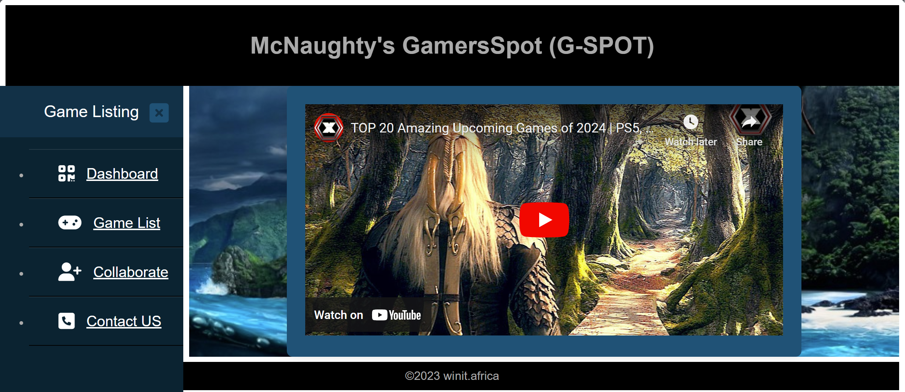
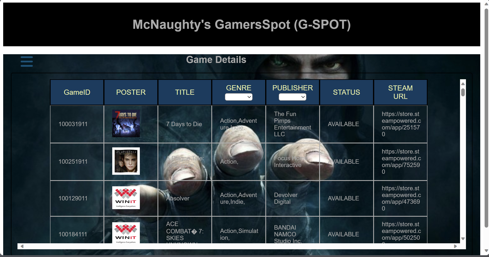
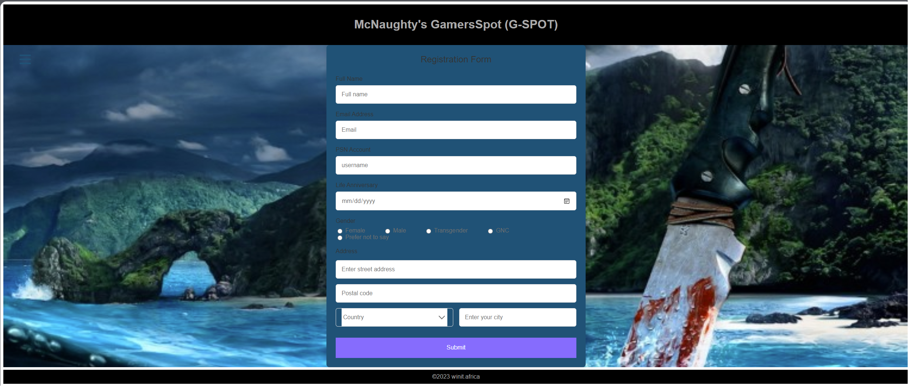

# Phase1Project-GamersSpot
Moringa Software Development Course - Phase one project

# Author
Winnie Abuor

# Live Site

https://mcnaughty.github.io/Phase1Project-GamersSpot/VideoPlayback.html

# McNaughty's GamerSpot (G-Spot)
This is is a game listing web page where video game enthusiasts can access and get information about some of the favorite games.

It allows for gamers to register to be collaborators and also filter for the games in question based on the genre and publisher. The gamers can also video updates about upcoming games.

The game listing app has modules shown below:

1. Main dashboard with the side bar

  
  

2. Game listing page where users will get information about the games

  
  

3. User registration form for those who want to subscribe and be collaborators

  
  

4. Contact form with the location

# Features
Display list of released video games available in the database using a json server : https://retoolapi.dev/iN1KN2/games
Fiilter out specific games based on the genre and the publishers
Subscribe to the gamers spot network
Watch a video of all upcoming video games

# Technology used
HTML
CSS
JavaScript
Json database (https://retoolapi.dev/iN1KN2/games && https://retoolapi.dev/qu2Ysx/userdata)

# How to Use
Clone this repository to your local machine.
Open the index.html file in your web browser to access the game listing website.
Learn information about your favorite video game titles.

# Contributions
Feel free to reach out and suggest additions and improvements to the listing web app. 

# Licensing
There is no license requirement at the moment to user the content provided.

